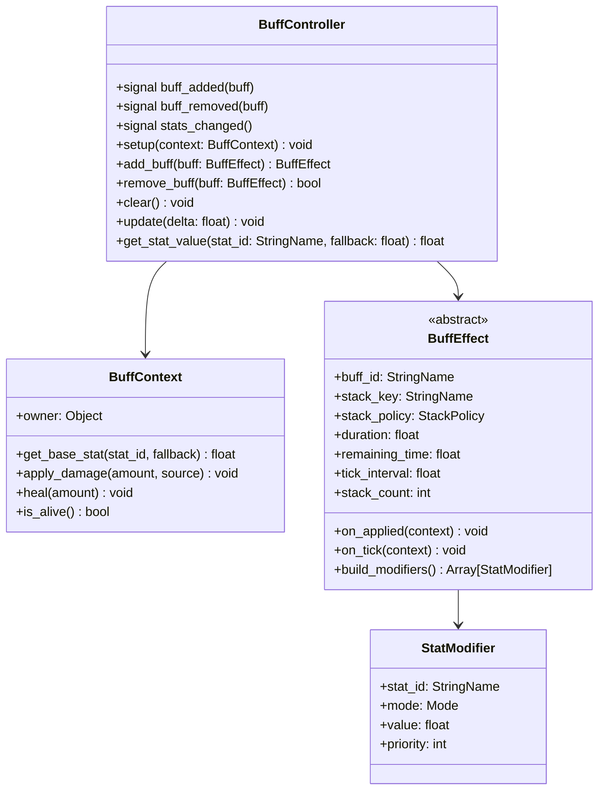

# Buff / 状态效果系统设计方案

## 目标

- 提供一套可复用、可扩展的 Buff / Debuff 框架。
- Buff 系统与具体 `Entity` 解耦，不直接篡改角色资源里的原始属性。
- 支持持续时间、永久 Buff、周期性 Tick、属性修正、叠加策略与自动过期。
- 兼容当前项目的 `Character + AttackModule + HealthComponent` 架构。

## 总体架构



## 模块职责

### 1. `BuffContext`

Buff 与宿主的唯一交互入口。

- 负责把“取基础属性”“受伤”“治疗”“是否存活”等能力以接口形式暴露给 Buff。
- `BuffEffect` 不直接访问 `Character.stats`、`Character.health`、`Character.attack_module`。
- 后续如果需要把 Buff 挂到玩家、敌人、召唤物、建筑物，只需给它们提供不同的 `BuffContext` 适配器。

### 2. `BuffController`

挂载在宿主上的状态控制组件，负责：

- 添加 / 移除 Buff
- 处理叠加策略
- 每帧推进持续时间与 Tick
- 聚合所有 `StatModifier`
- 提供实时属性查询 `get_stat_value()`
- Buff 过期后自动销毁

### 3. `BuffEffect`

抽象 Buff 基类，统一管理：

- `duration` / `remaining_time`
- `is_permanent`
- `tick_interval`
- `stack_policy`
- `stack_count`

并提供以下扩展点：

- `on_applied(context)`
- `on_removed(context)`
- `on_tick(context)`
- `build_modifiers()`
- `on_refreshed(incoming)`
- `on_stacked(incoming)`

### 4. `StatModifier`

纯属性修正数据对象。

- `stat_id`：目标属性，例如 `max_health`、`light_attack_damage`
- `mode`：`ADD` 或 `MULTIPLY`
- `value`：
	- `ADD` 表示直接加值，如 `+15`
	- `MULTIPLY` 表示倍率增量，如 `+20%` 记为 `0.2`
- `priority`：同一层级内的排序键，保证计算顺序稳定且可扩展

## Buff 基类设计

## 生命周期字段

| 字段 | 说明 |
| --- | --- |
| `buff_id` | Buff 类型标识 |
| `stack_key` | 用于判定同类 Buff 是否冲突/合并 |
| `duration` | 总时长，`<= 0` 时可视为无时长 |
| `remaining_time` | 剩余时间 |
| `is_permanent` | 是否永久存在 |
| `tick_interval` | Tick 周期；`<= 0` 代表无 Tick |
| `stack_count` | 当前层数 |
| `max_stacks` | 最大层数 |

## Tick 规则

- `tick_interval > 0` 时，`BuffController.update(delta)` 会累计时间。
- 每当累计值达到周期，就触发一次 `on_tick(context)`。
- 多个 Tick 可以在同一帧内补发，避免低帧率下丢 Tick。
- 非永久 Buff 的时间归零后，当前帧结束前移除。

## 永久 Buff

- `is_permanent = true`
- 不推进 `remaining_time`
- 只会在手动移除、宿主死亡清空、或场景销毁时结束

## 叠加策略

支持 4 种策略：

### 1. `OVERRIDE`

- 同 `stack_key` 的旧 Buff 被移除
- 新 Buff 顶替旧 Buff
- 适合“唯一状态”“高等级覆盖低等级”

### 2. `RESET_DURATION`

- 不新增实例
- 仅刷新同类 Buff 的持续时间
- 不叠加数值
- 适合“重复施加只续杯”的增益/减益

### 3. `STACK_VALUES`

- 不新增实例
- 将 `stack_count` 累加到上限
- 数值效果由 `stack_count` 放大
- 默认同时刷新持续时间
- 适合中毒、流血、灼烧等可堆层效果

### 4. `INDEPENDENT`

- 每次施加都生成新实例
- 各自拥有独立时长、独立 Tick
- 适合来自不同来源、必须单独结算的状态

## Modifier 逻辑与计算顺序

统一公式：

`最终值 = (基础值 + 加法总和) * 乘法系数`

其中：

- `基础值` 来自宿主原始属性，例如 `CharacterStats.max_health`
- `加法总和` 为所有 `ADD` 类型修正值求和
- `乘法系数` 初始为 `1.0`，每个乘法 Modifier 按 `(1.0 + value)` 参与连乘

### 顺序约束

1. 先处理全部 `ADD`
2. 再处理全部 `MULTIPLY`
3. 同一类型内部按 `priority` 升序处理
4. `priority` 相同时，保持加入顺序稳定

### 为什么还需要 `priority`

当前只有加法和乘法两层时，数值结果通常可交换；但提前保留 `priority` 有两个价值：

- 保证日志、调试、回放时的顺序稳定
- 为后续扩展“覆盖值 / 最终值钳制 / 条件修正器”预留位置

## 与 Entity 解耦的实现方式

不让 Buff 直接依赖 `Character` 的字段。

### 宿主提供的最小能力

- `get_base_stat(stat_id, fallback)`
- `apply_damage(amount, source)`
- `heal(amount)`
- `is_alive()`

### 当前项目中的挂载方式

- `Character` 在 `_ready()` 中创建 `BuffContext` 与 `BuffController`
- `Character` 只作为宿主适配层，不把 Buff 逻辑写进 `AttackModule`
- `AttackModule` 在真正造成伤害时，通过宿主的 `get_stat_value()` 获取当前实时属性

这样 Buff 可以复用于：

- 玩家
- 敌人
- NPC
- 未来的可破坏物 / 召唤物

## 当前接入点

### 1. 生命值

- `max_health` 改为通过 Buff 实时计算
- `HealthComponent` 新增 `set_max_health()`，用于在状态变化时同步上限
- 不改写原始 `CharacterStats.max_health`

### 2. 攻击值

- `light_attack_damage`
- `hard_attack_damage`
- `ultimate_attack`

攻击模块不再在开招时把固定伤害写死，而是在命中结算时读取实时属性，确保 Buff 生效即时反映到伤害。

### 3. 状态清理

- 角色死亡时清空 Buff，避免流血、狂暴等在尸体上继续运行
- 复活时重新以基础属性初始化生命值

## 示例 Buff

### 流血 `BleedBuff`

- 类型：Debuff
- 叠加：`STACK_VALUES`
- 机制：每秒触发一次 Tick，对宿主造成持续伤害
- 默认行为：
	- 每层每 Tick 扣 `5` 点血
	- 默认持续 `5` 秒
	- 默认最多 `5` 层

### 狂暴 `BerserkBuff`

- 类型：Buff
- 叠加：`RESET_DURATION`
- 机制：使攻击力提高 `20%`
- 修正方式：对 `light_attack_damage`、`hard_attack_damage`、`ultimate_attack` 添加 `MULTIPLY = 0.2`
- 默认持续 `10` 秒

## 运行时 API 约定

### 宿主接口

- `add_buff(buff: BuffEffect) -> BuffEffect`
- `remove_buff(buff: BuffEffect) -> bool`
- `clear_buffs() -> void`
- `get_stat_value(stat_id: StringName, fallback: float = 0.0) -> float`

### 用法示例

```gdscript
var bleed := BleedBuff.new()
bleed.damage_per_tick = 5.0
target.add_buff(bleed)

var berserk := BerserkBuff.new()
target.add_buff(berserk)
```

## 验收标准

- 可以给任意实现了宿主接口的对象挂载 `BuffController`
- Buff 支持添加、移除、自动过期、手动清空
- 属性查询始终走实时计算结果
- 叠加策略四种模式可工作
- `流血` 能持续扣血
- `狂暴` 能让攻击伤害提高 `20%`，并在 `10` 秒后自动恢复
