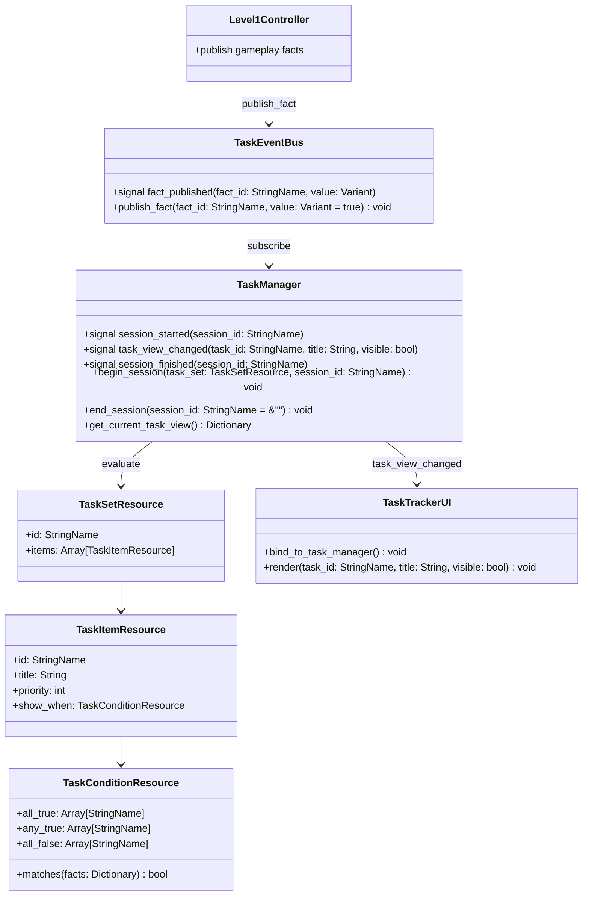

# Task System Refactor Plan

## Summary
- Replace the current `level_1.gd -> ObjectiveLabel.text` coupling with a reusable, data-driven task system.
- Version 1 is scene-scoped, shows one active task at a time, and stores task definitions in Godot `Resource` assets.
- Gameplay scripts publish facts only. `TaskManager` evaluates task definitions and `TaskTrackerUI` renders the current task.

## Core Design

## Responsibilities
### TaskEventBus
- Autoload event hub for task facts.
- Accepts idempotent fact publications from gameplay scripts.
- Does not store task logic or UI state.

### TaskManager
- Owns the current task session and the in-memory fact dictionary.
- Recalculates the active task when facts change.
- Emits a compact task view model for UI listeners.

### Task Resources
- `TaskSetResource` groups a scene's task definitions.
- `TaskItemResource` stores display text, priority, and condition.
- `TaskConditionResource` evaluates `all_true`, `any_true`, and `all_false`.

### TaskTrackerUI
- Listens to `TaskManager.task_view_changed`.
- Renders the current task text and visibility only.
- Contains no gameplay branching or task progression logic.

## Runtime API
### Autoloads
- `TaskEventBus="*res://Global/task_event_bus.gd"`
- `TaskManager="*res://Global/task_manager.gd"`

### Public Methods
- `TaskEventBus.publish_fact(fact_id: StringName, value: Variant = true) -> void`
- `TaskManager.begin_session(task_set: TaskSetResource, session_id: StringName) -> void`
- `TaskManager.end_session(session_id: StringName = &"") -> void`
- `TaskManager.get_current_task_view() -> Dictionary`

### Signals
- `TaskEventBus.fact_published(fact_id, value)`
- `TaskManager.session_started(session_id)`
- `TaskManager.task_view_changed(task_id, title, visible)`
- `TaskManager.session_finished(session_id)`

## Lifecycle
1. `level_1.gd` starts the scene task session in `_ready()`.
2. `TaskTrackerUI` binds to `TaskManager` and renders the current view immediately.
3. `level_1.gd` publishes facts for dialogue, key pickup, door opening, and level finish.
4. `TaskManager` re-evaluates the task set and emits a new UI view only when it changes.
5. `level_1.gd` ends the task session in `_exit_tree()` to avoid leaking task text into the next scene.

## Level 1 Fact Table
| Fact ID | Meaning |
| --- | --- |
| `level_1.archer_dialogue_active` | Archer dialogue is currently running |
| `level_1.archer_dialogue_finished` | Archer dialogue has completed at least once |
| `level_1.key_collected` | The level key has been collected |
| `level_1.door_opened` | The exit door has opened |
| `level_1.level_finished` | The player has reached the finish trigger |

## Level 1 Task Table
| Task ID | Title | Priority | Condition |
| --- | --- | --- | --- |
| `intro_explore` | `Explore forward area` | `10` | All listed facts are false |
| `listen_archer` | `Listen to Archer` | `40` | `archer_dialogue_active` is true and `archer_dialogue_finished` is false |
| `find_key` | `Find the key` | `30` | `archer_dialogue_finished` is true while key, door, and finish remain false |
| `door_opening` | `Door opening` | `20` | `key_collected` is true while door and finish remain false |
| `reach_exit` | `Head to the exit` | `15` | `door_opened` is true while finish remains false |
| `level_complete` | `Level complete` | `5` | `level_finished` is true |

## UI Boundaries
- The task UI stays in the top-left corner and reuses the existing text theme.
- The task UI may wrap to a second line, but it never decides what task is active.
- No door, key, dialogue, or level-state checks are allowed in the UI layer.

## Test And Acceptance
- Launching `level_1` shows `Explore forward area` through `TaskManager`.
- Normal flow updates task text in this order:
	1. `Listen to Archer`
	2. `Find the key`
	3. `Door opening`
	4. `Head to the exit`
	5. `Level complete`
- Nonlinear flow does not soft-lock:
	- key before dialogue
	- dialogue after key
	- repeated key and door events
- Changing scenes clears the task UI.
- `level_1.gd` no longer writes to `ObjectiveLabel.text`.
